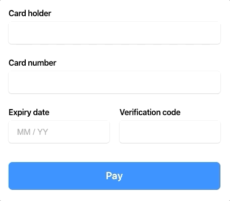
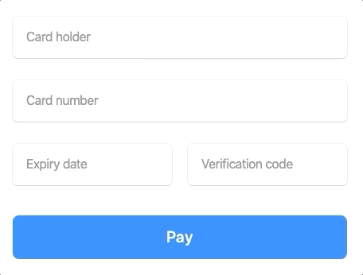

# Mollie Components Examples

This repository contains examples on how to implement Mollie Components.

## Example 1 (regular labels)
[HTML](example-1/index.html) | [CSS](example-1/style.css) | [Javascript](example-1/script.js)



## Example 2 (floating labels)
[HTML](example-2/index.html) | [CSS](example-2/style.css) | [Javascript](example-2/script.js)



## Running locally

If you have Python on your local system you can run the following command in the root directory.

```bash
python -m SimpleHTTPServer 3000
```

Now open [localhost:3000](http://localhost:3000) in your browser to view
the examples.