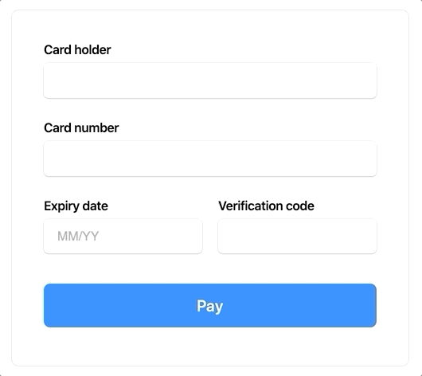
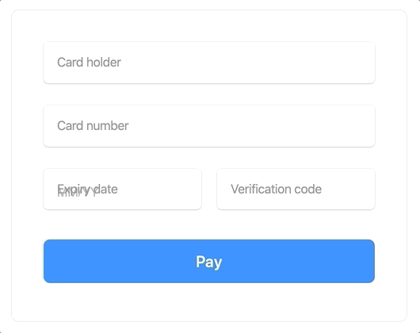

# Mollie Components Examples

This repository contains examples on how to implement Mollie Components.

## Example 1 (regular labels)
[HTML](/examples/example1/index.html) | [CSS](/examples/example1/style.css)

## Example 2 (floating labels)
[HTML](/examples/example2/index.html) | [CSS](/examples/example2/style.css)

