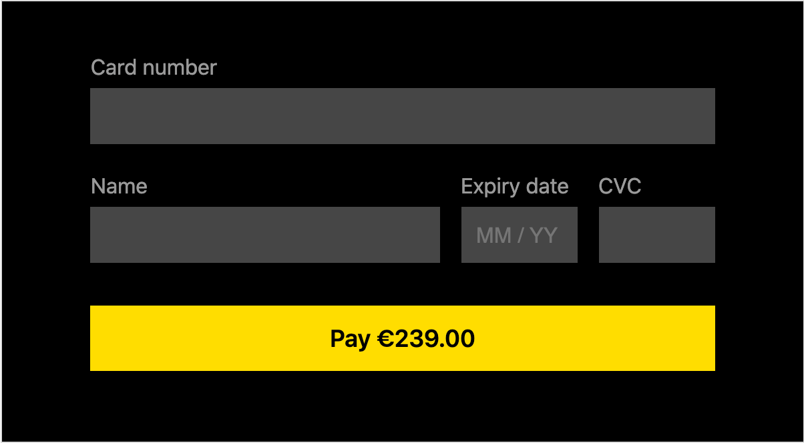
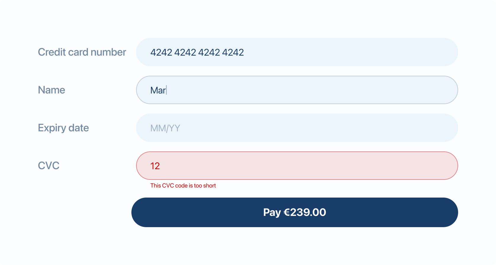
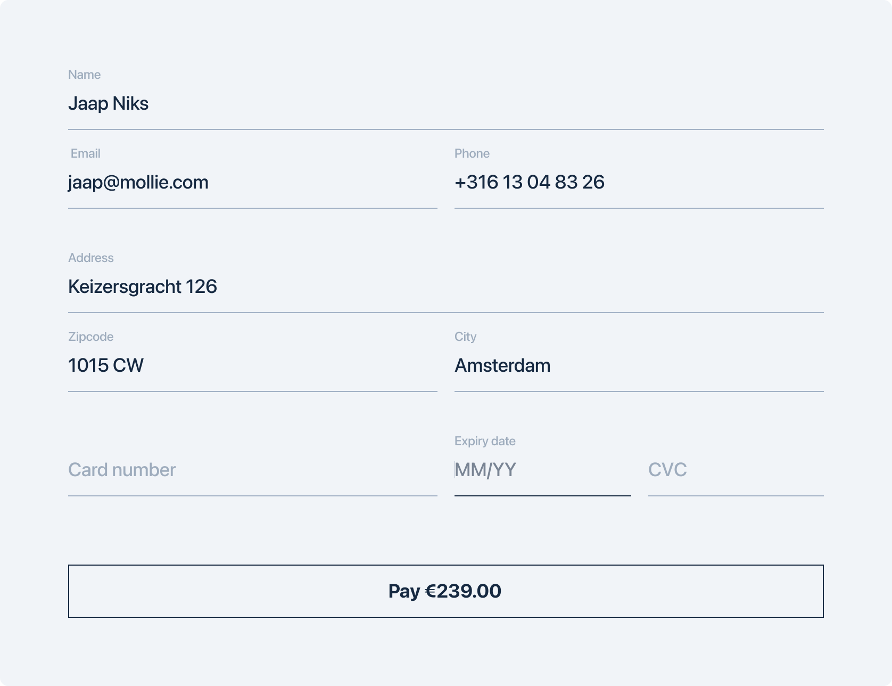
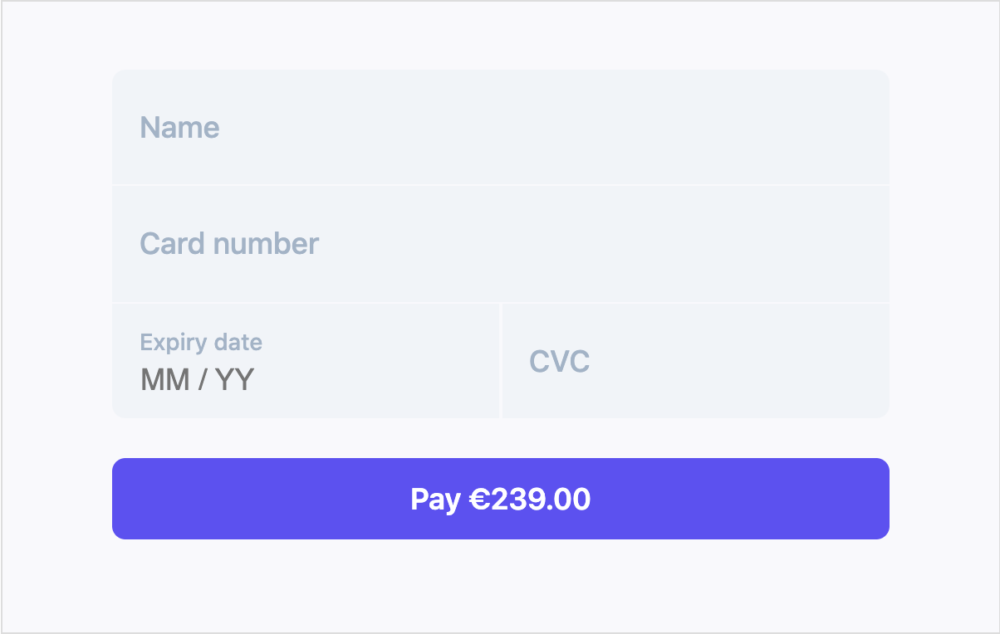
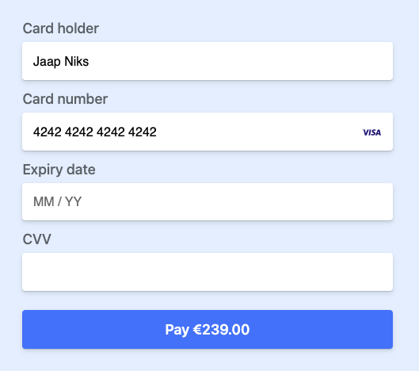

# Mollie Components Examples

This repository contains examples on how to implement [Mollie Components](https://docs.mollie.com/guides/mollie-components/overview). Mollie Components is a set of Javascript APIs that allows you to add the fields needed for card holder data to your own checkout, in a way that is fully PCI-DSS SAQ-A compliant.

See the live demo of these examples here: https://mollie.github.io/components-examples/


## Documentation

- [Integration guide](https://docs.mollie.com/guides/mollie-components/overview)
- [API reference](https://docs.mollie.com/guides/mollie-components/reference)
- [Handling errors](https://docs.mollie.com/guides/mollie-components/handling-errors)
- [Styling](https://docs.mollie.com/guides/mollie-components/styling)

## Examples

- [Example 1](./example-1/): Basic example

<a href="./example-1/"></a>

- [Example 2](./example-2/): Floating labels

<a href="./example-2/"></a>

- [Example 3](./example-3/): Vertical layout

<a href="./example-3/"></a>

- [Example 4](./example-4/): Floating labels and additional input fields

<a href="./example-4/"></a>

- [Example 5](./example-5/): Floating labels with status indicators

<a href="./example-5/"></a>

- [Example 6](./example-6/): Single component

<a href="./example-6/"></a>

## Running locally

In order to run the examples you need a webserver. Although its plain HTML, CSS and JavaScript Mollie Components needs a valid hostname (e.g. localhost or 127.0.0.1). For this README example we use the [serve](https://www.npmjs.com/package/serve) package but any other webserver should work just fine.

1. Clone the repo

```bash
git clone git@github.com:mollie/components-examples.git
```

2. Navigate to the the repo

```bash
cd components-example
```

3. Serve the examples via a webserver

```bash
npx serve
```
